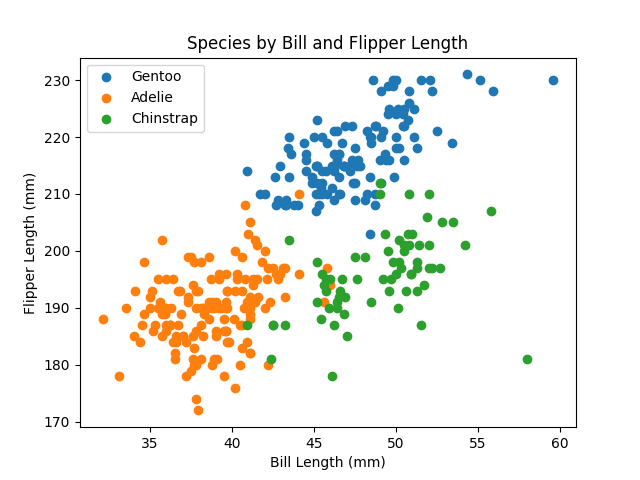

# HW 1

The first homework assignment where we learn how to make graphs usng various plotting techniques and how to interface git.

## Clone the repo

First clone it.

```
git clone https://github.com/alex-riz-NE/hw1-penguins-alex-riz-NE.git
```

### Reproducibility

Download the source CSV with the following command

```
make data
```

* You need to do this when you first clone the repo because CSV files are .gitignored.
* If you make a local copy of a dataset, be sure to provide appropriate attribution.
* Be very clear about anything you did to process the data. 
* Results must be reproducible. Provide clear instructions for every step.
* One nice thing about *make* is that you can edit the Makefile without having to edit this README.
* One annoying thing about *make* is that indents in the Makefile must be tabs -- spaces don't work.
* If you don't have `make` then you're probably using Windows. If so, consider [Cygwin](https://www.cygwin.com/).

### Presenting results

Here's The Figure from the data set



Recreate this chart with
```
make app
```

## requirements

I created the requirements.txt by first running this command

```
conda list -e > requirements.txt
```

Then I edited it to include only the modules that I imported in my code, along with the python version.
```
conda list -e > requirements.txt
```

You can use the requirements.txt to create a conda environment and run code as follows:
```
conda create --name demo --file requirements.txt
conda activate demo
make app
conda deactivate
```

### github pages

* [github pages](https://pages.github.com/)
* Activate a github-pages site for a repository in Settings > Pages
* I do *NOT* recommend using Jekyll for this class.

### seaborn issue

For some reason (python not installed as a framework?), plt.show() with seaborn hangs my terminal.
Fix this by turning off interactive mode:
```
plt.ioff()
```
You can also fix this by using a different backend:
```
matplotlib.use('TkAgg')
```
List all the backends and the current backend with:
```
print(plt.get_backend())
print(matplotlib.rcsetup.all_backends)
```
Or, to avoid using matplotlib, add the following to `~/.zprofile`:
```
# Avoids seaborn hang on my old macbook pro
export MPLBACKEND=qtagg
```
